# Imagens Midjourney — marca Téra

> Geradas pelo render stack (http://100.75.131.85:4173) via `tools/midjourney-minimax-stack/scripts/generate-tera-images.mjs`.
> Última execução: 2026-08-20T04:45:53.293Z

| Imagem | Ilustra | Seed | Job |
|---|---|---|---|
|  `04-materia-plasma-hero.png` | brand/04_IDENTIDADE_BRIEF.md §05 (matéria digital viva) — hero | 3012096405 | render_1787200659168_l7cp59 |
| 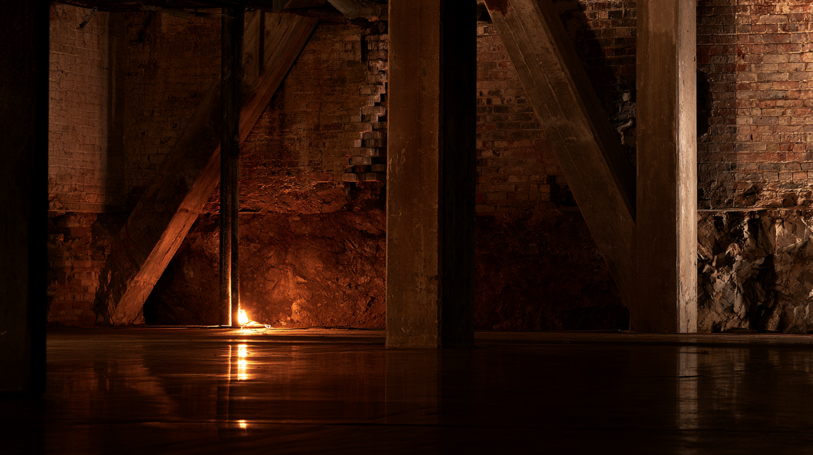 `04-patrimonio-cru.png` | brand/04_IDENTIDADE_BRIEF.md §05 (patrimônio cru) | 3590633290 | render_1787200685097_t28s4f |
|  `04-rio-digital-arquitetura.png` | brand/04_IDENTIDADE_BRIEF.md §02/§08 (o rio que entra pelo vão das portas — Reveal) | 2143648440 | render_1787200704075_81hdf5 |
| 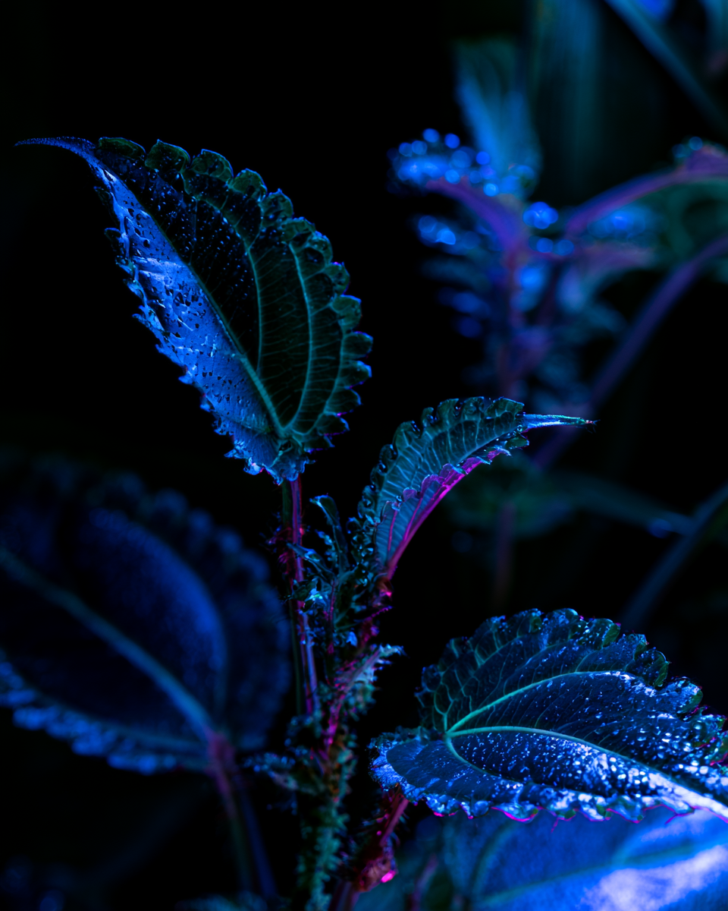 `04-botanica-iridescente.png` | brand/04_IDENTIDADE_BRIEF.md §03 (azul bioluminescência, mata à noite) | 2884913151 | render_1787200729154_uop100 |
| 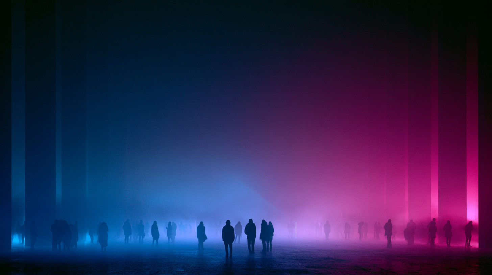 `04-silhuetas-contraluz.png` | brand/04_IDENTIDADE_BRIEF.md §05 (pessoas como silhueta, nunca posando) | 638230580 | render_1787200748154_l2951y |
| 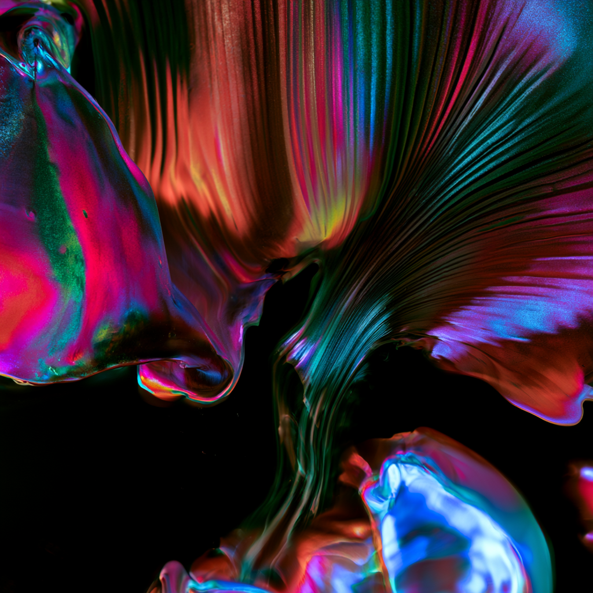 `04-macro-fluido-perlaceo.png` | brand/04_IDENTIDADE_BRIEF.md §05 (tecido líquido perláceo, fluidos marmorizados) | 3831624710 | render_1787200767245_rpsl7n |
| 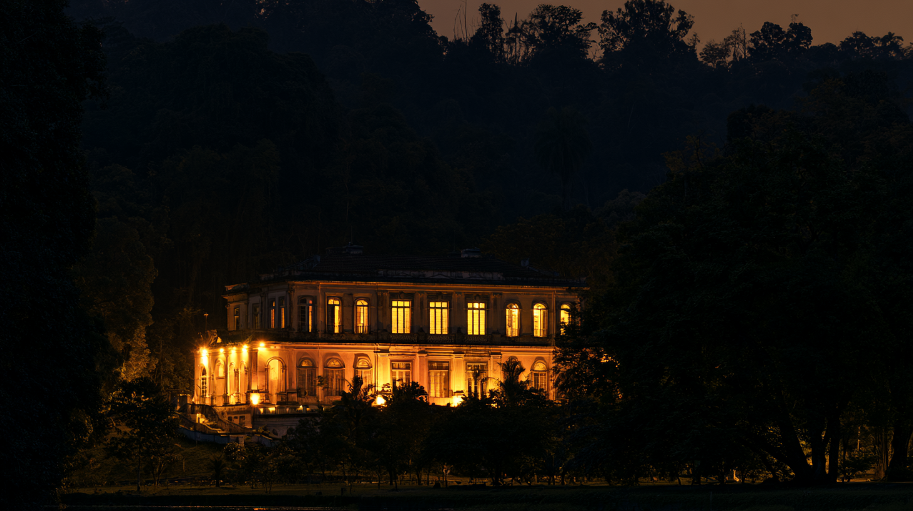 `04-casarao-ambar.png` | brand/04_IDENTIDADE_BRIEF.md §03 (âmbar patrimônio: casarão aceso na mata) | 3754124190 | render_1787200786391_8hn81z |
| 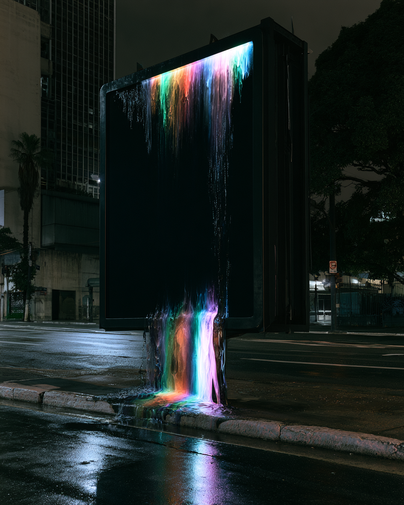 `04-ooh-plasma-borda.png` | brand/04_IDENTIDADE_BRIEF.md §08 (OOH: plasma escorre pela borda do formato) | 3594046158 | render_1787200811313_ij7uzk |
| 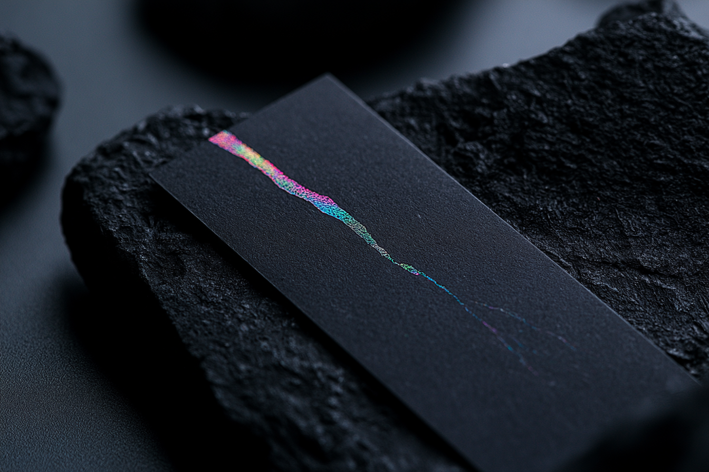 `04-ingresso-materia.png` | brand/04_IDENTIDADE_BRIEF.md §08 (ingresso: fragmento único de matéria plasma) | 2267854103 | render_1787200836352_qsd9uh |
| 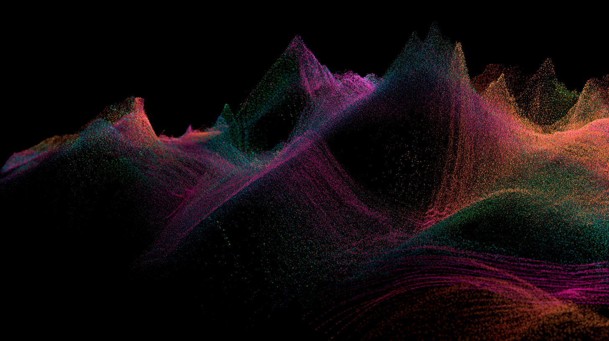 `04-pointcloud-granular.png` | brand/04_IDENTIDADE_BRIEF.md §05 (matéria granular pointcloud) | 1499166755 | render_1787200856026_rfz0cg |
| 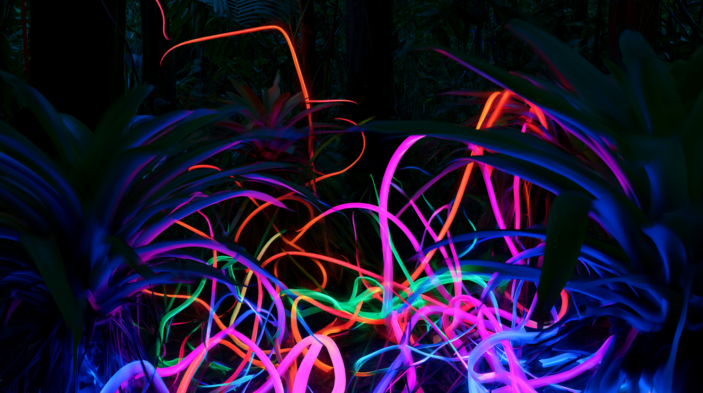 `01-tubos-organicos-mata.png` | brand/01_BRIEFING_CLIENTE.md slides 01/13 + 09_GUIDELINES motivo 1 (a estética-mãe do plasma) | 2766282199 | render_1787200874612_kaq0wj |
| 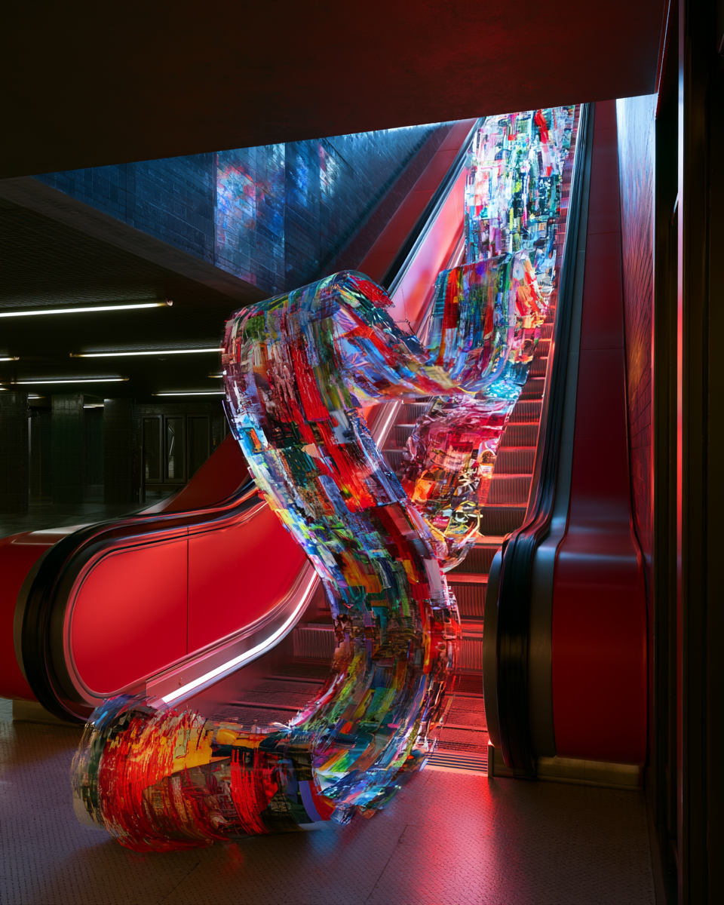 `01-fita-digital-escadaria.png` | brand/01_BRIEFING_CLIENTE.md slide 16 + 09_GUIDELINES motivo 2 (fita de fragmentos digitais na arquitetura urbana) | 1086114649 | render_1787200900301_qo4rn0 |
|  `08-plasma-frestas-macro.png` | brand/08_MANIFESTO.md beat 1 + 11_LANCAMENTO teaser (frestas vazando luz digital, sem logo, sem texto) | 900103423 | render_1787200919423_4vcxjf |
|  `08-vao-das-portas.png` | brand/08_MANIFESTO.md beat final + 11_LANCAMENTO beat 4 (a câmera nunca entra: a porta é o limite do quadro) | 3225218577 | render_1787200938300_3flgyx |
|  `02-limiar-de-luz.png` | brand/02_ESTRATEGIA.md (não é uma tela para ver: sala para habitar) + 07_HISTORIA (a fonte de luz fora de quadro) | 3483128913 | render_1787200956943_mwmuid |
| 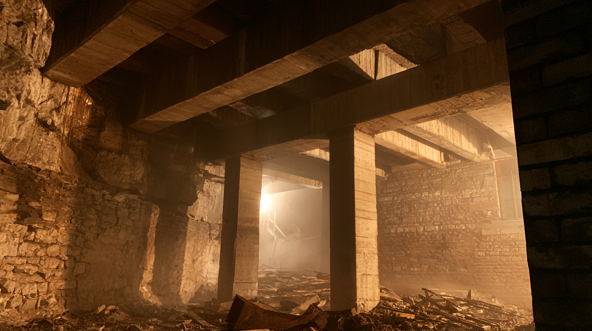 `07-vigas-contra-rocha.png` | brand/07_HISTORIA.md abertura (vigas novas de concreto travadas contra a rocha e a alvenaria histórica) | 2836097786 | render_1787200981743_i6qx3y |
| 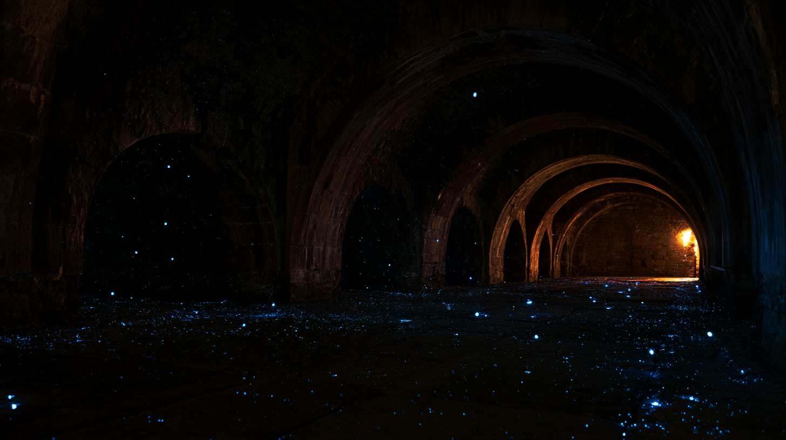 `12-subsolo-vagalumes.png` | brand/12_SOM.md (o subsolo audível: vão grande, pedra, pontos azuis como vaga-lumes lentos) | 3828972466 | render_1787201006428_687eqn |
| 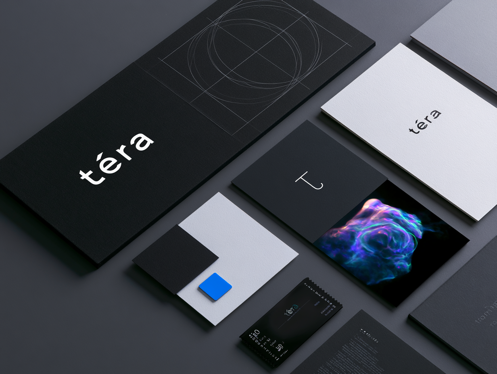 `logo-board-sistema.png` | brand/15_SISTEMA_VISUAL.md — board 3×3 do sistema de identidade completo | 2924164272 | render_1787201068515_d2rxxo |
| 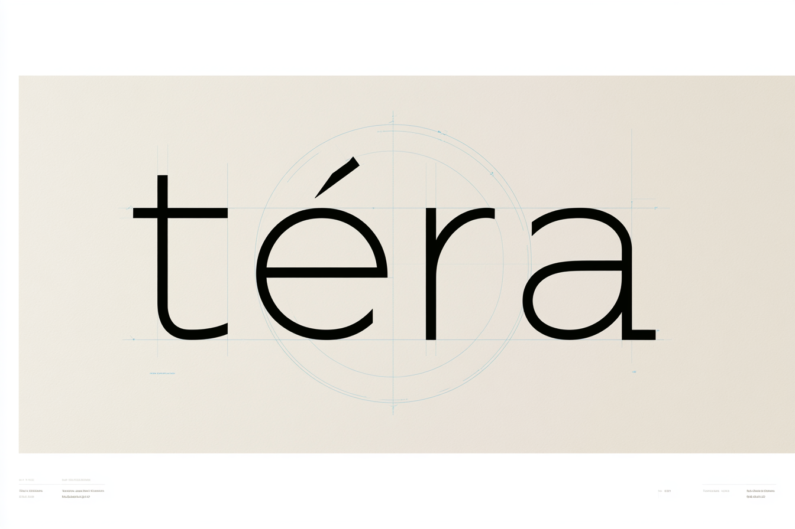 `logo-construcao-geometria.png` | brand/15_SISTEMA_VISUAL.md §1 (wordmark de arcos: um raio, uma espessura) | 1577641325 | render_1787201093521_yxj5od |
| 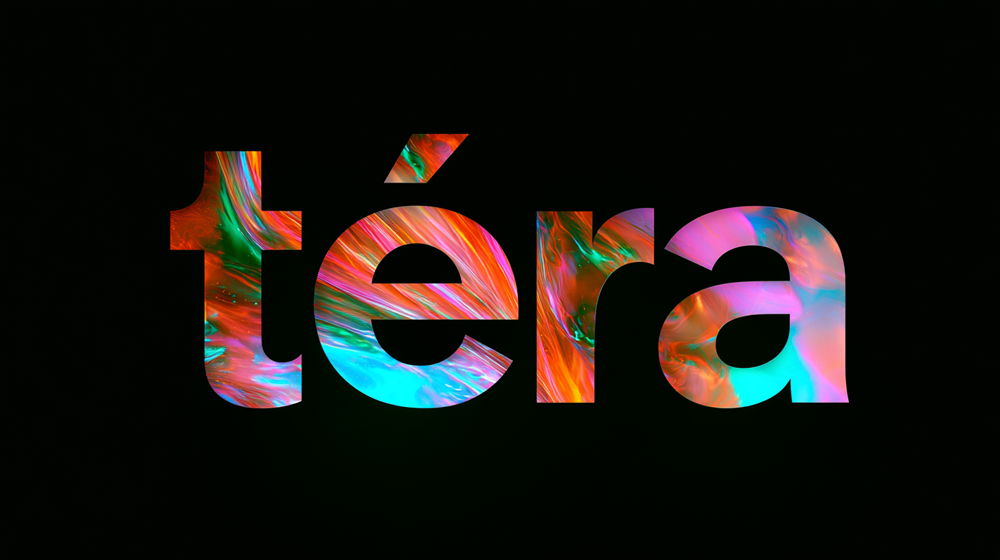 `logo-estado-materia.png` | brand/15_SISTEMA_VISUAL.md §1 (estado matéria: letras como vãos por onde o plasma passa) | 3845659348 | render_1787201112187_0ulqv0 |
| 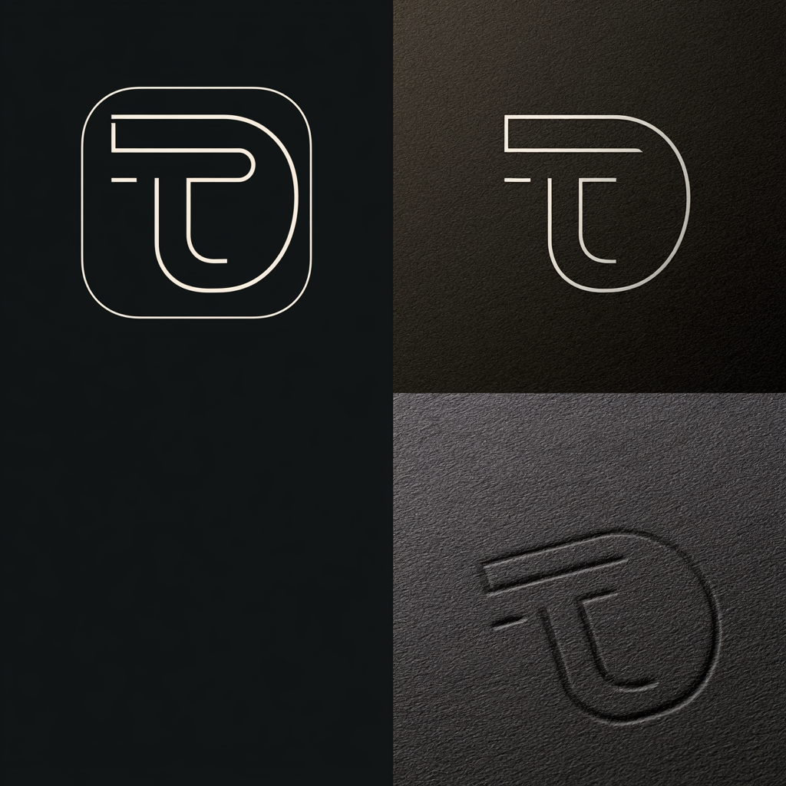 `logo-monograma-t.png` | brand/15_SISTEMA_VISUAL.md §2 (monograma t: avatar, favicon, carimbo) | 1851615124 | render_1787201130848_uvkfft |
| 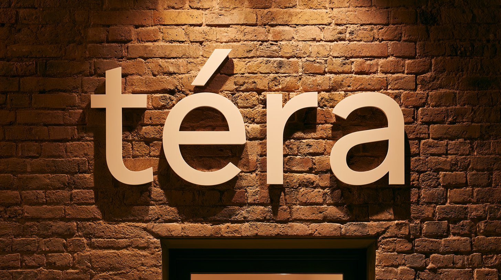 `logo-sinalizacao-fachada.png` | brand/15_SISTEMA_VISUAL.md + brand/04 §08 (aplicação ambiental sobre patrimônio) | 1734938834 | render_1787201149667_ucwyyc |
| 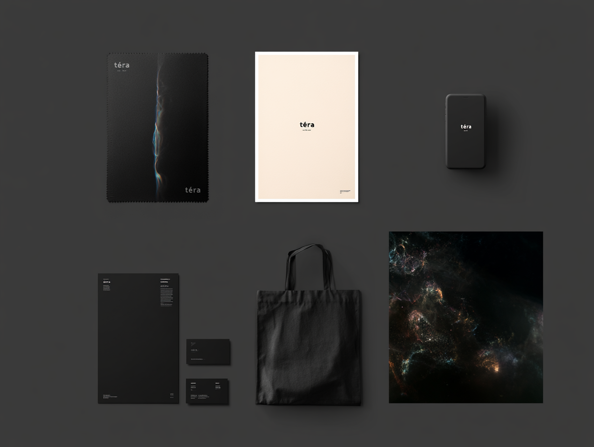 `logo-aplicacoes-board.png` | brand/04 §08 + brand/15 (mini-deck de aplicações: ingresso, poster, avatar, papelaria) | 2881860041 | render_1787201168394_9h9mi2 |

## Prompts

### 04-materia-plasma-hero

```
iridescent liquid plasma emerging from total darkness, flowing organic ribbons of magenta pink, ember orange, sap green and bioluminescent electric blue light, pearlescent living fluid suspended in a black void, light born from darkness, extreme macro photography, contemporary art, no text, no words, no letters, no watermark --ar 21:9 --v 8
```

### 04-patrimonio-cru

```
raw historic brick masonry walls and exposed concrete beams braced against bedrock, construction site inside a century-old industrial building at night, single low amber tungsten work light, dark reflective polished floor, deep dense shadows, documentary architecture photography, chiaroscuro, no people, no text, no words, no letters, no watermark --ar 16:9 --v 8
```

### 04-rio-digital-arquitetura

```
a river of glowing multicolored digital matter flowing down the facade of a historic brick industrial complex at night and pouring through open doorways, luminous organic ribbon of magenta orange green and blue light against near-black architecture, long exposure night photography, mysterious, nothing revealed inside, no text, no words, no letters, no watermark --ar 21:9 --v 8
```

### 04-botanica-iridescente

```
digital iridescent botany, bioluminescent tropical plants glowing electric blue in a pitch-dark brazilian forest at night, subtle magenta and sap green accents on leaf edges, dew and organic detail, macro photography, deep black background, light emerging from darkness, no text, no words, no letters, no watermark --ar 4:5 --v 8
```

### 04-silhuetas-contraluz

```
small silhouettes of people in backlight standing inside a vast dark monumental hall, immersed in a haze of organic multicolored light, magenta and blue atmospheric glow, no screens visible, no faces, figures dwarfed by darkness, cinematic wide shot, no text, no words, no letters, no watermark --ar 16:9 --v 8
```

### 04-macro-fluido-perlaceo

```
extreme macro of marbled pearlescent fluid, ink swirls of magenta pink, ember orange, sap green and electric blue folding into liquid black, organic pleats draping like cloth, high contrast, saturated color on darkness, contemporary abstract art, no text, no words, no letters, no watermark --ar 1:1 --v 8
```

### 04-casarao-ambar

```
historic early 20th century brazilian industrial mansion glowing with warm amber light from within, surrounded by dense dark forest at night, warm tungsten temperature against deep black vegetation, architectural night photography, quiet monumental mood, no people, no text, no words, no letters, no watermark --ar 16:9 --v 8
```

### 04-ooh-plasma-borda

```
matte black blank billboard on a dark são paulo street at night, luminous organic multicolored plasma dripping and bleeding from its top edge as if leaking out of the structure, wet asphalt reflections, no visible advertisement, urban night photography, mysterious, no text, no words, no letters, no watermark --ar 4:5 --v 8
```

### 04-ingresso-materia

```
premium matte black event ticket lying on dark stone, a single thin vein of iridescent multicolored plasma light embedded across its surface like a crack of living matter, dramatic macro product photography, single soft light source, deep shadows, no text, no words, no letters, no watermark --ar 3:2 --v 8
```

### 04-pointcloud-granular

```
granular pointcloud matter forming a floating organic terrain in darkness, millions of fine luminous particles in magenta orange green and blue, volumetric digital dust emerging from a black void, no hard geometry, contemporary generative art, no text, no words, no letters, no watermark --ar 16:9 --v 8
```

### 01-tubos-organicos-mata

```
organic multicolored luminous tubes in gradients of orchid pink, sprout orange, sap green and electric blue, serpentining between dense dark atlantic forest vegetation like roots or tentacles of light, bromeliads in darkness, glowing tubular sprouts emerging from black forest floor at night, contemporary digital art, light born from darkness, no text, no words, no letters, no watermark --ar 16:9 --v 8
```

### 01-fita-digital-escadaria

```
a continuous ribbon of glitched digital collage fragments, colorful textures and imagery, flowing down step by step over a red subway escalator in a dark urban station at night, augmented reality matter inhabiting real architecture, long ribbon twisting through the space, cinematic night photography, dark surroundings, no text, no words, no letters, no watermark --ar 4:5 --v 8
```

### 08-plasma-frestas-macro

```
close-up of the joints and cracks of a historic brick and stone facade at night, iridescent multicolored digital plasma light leaking and seeping out from inside the cracks, magenta orange green and blue glow escaping the masonry seams, everything else near-black, mysterious teaser mood, macro architectural photography, no text, no words, no letters, no watermark --ar 16:9 --v 8
```

### 08-vao-das-portas

```
massive heavy historic industrial doors slightly ajar at night, a river of luminous multicolored organic matter flowing through the narrow gap into the building, interior completely hidden in darkness, camera outside facing the threshold, brick facade in low amber light, nothing revealed inside, cinematic, no text, no words, no letters, no watermark --ar 16:9 --v 8
```

### 02-limiar-de-luz

```
a single human silhouette crossing a tall doorway of soft spectral light in a vast dark historic hall, light source out of frame, figure in full backlight about to step through, magenta and blue atmospheric glow spilling from the threshold, monumental darkness around, cinematic, no face visible, no screens, no text, no words, no letters, no watermark --ar 4:5 --v 8
```

### 07-vigas-contra-rocha

```
new raw concrete structural beams braced directly against exposed bedrock and century-old brick masonry, underground construction site, low warm amber tungsten work lights, construction dust in the air, the meeting of heritage and future in one frame, documentary photography, deep shadows, no people, no text, no words, no letters, no watermark --ar 16:9 --v 8
```

### 12-subsolo-vagalumes

```
vast empty historic basement vault with stone floor and old masonry arches in near-total darkness, sparse tiny electric blue bioluminescent points of light floating slowly like fireflies in the void, damp air, one distant amber glow, quiet monumental atmosphere, long exposure night photography, no text, no words, no letters, no watermark --ar 16:9 --v 8
```

### logo-board-sistema

```
premium brand identity system board for "téra", 3x3 presentation grid on warm near-black charcoal canvas with strong gutters: large minimal lowercase geometric wordmark "téra" built from circle arcs in warm off-white ink as cover panel, arc construction diagram with thin geometric guide circles, lowercase monogram "t" as app icon, warm off-white paper panel with the wordmark in black ink, color swatch panel with warm black, chalk white and one electric blue chip, one panel of iridescent organic plasma matter on darkness, physical ticket application panel, quiet typography specimen panel, sparse premium brand guidelines deck, intentional, art-directed, no clutter, no long text --ar 4:3 --v 8
```

### logo-construcao-geometria

```
logo construction diagram of a minimal geometric lowercase wordmark "téra" built entirely from circle arcs with one consistent radius and one consistent stroke weight, thin construction guide circles and measurement lines in pale blue on warm off-white paper, black monolinear letterforms, swiss typographic precision, brand guidelines page, small technical labels, sparse and clean, no watermark --ar 3:2 --v 8
```

### logo-estado-materia

```
the lowercase word "téra" cut out as letter-shaped voids in a matte warm black surface, iridescent organic plasma in magenta orange green and electric blue flowing and glowing through the letter openings from behind, letters as windows into living matter, everything else deep black, premium brand identity concept, cinematic macro, no additional text --ar 16:9 --v 8
```

### logo-monograma-t

```
minimal geometric lowercase letter "t" mark built from circle arcs, monolinear stroke, warm off-white on warm near-black background, presented as a rounded-square app icon and as a blind embossed stamp on dark textured paper, two-panel premium presentation, refined negative space, brand mark study, no other text --ar 1:1 --v 8
```

### logo-sinalizacao-fachada

```
minimal lowercase geometric wordmark "téra" as discreet dimensional signage letters in warm off-white mounted on a raw historic brick masonry wall, lit by low warm amber architectural lighting at night, deep shadows around, heritage building entrance, quiet monumental institutional signage, architectural photography, no other text --ar 16:9 --v 8
```

### logo-aplicacoes-board

```
premium 2x3 brand applications board for the lowercase geometric arc-built wordmark "téra" on warm near-black canvas with clean gutters: matte black event ticket with the wordmark and a thin vein of iridescent plasma, minimal poster in warm off-white with black wordmark, dark app icon with lowercase "t" mark, black letterhead and business card stationery pair, dark tote bag, one atmosphere panel of multicolored organic light on darkness, sparse, intentional, brand guidelines deck quality, no long text --ar 4:3 --v 8
```
