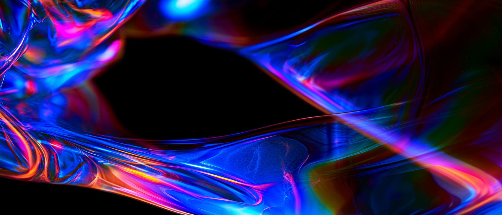

# Brand Context

> Fonte única: briefing do cliente "Sala Abaixo_Briefing Reveal Jul2026.pptx" (transcrito em `tera-brand-system/TERA_BRIEFING_CLIENTE.md`). Nenhuma decisão criativa do estúdio incluída.

## Brand
- **Name**: Téra
- **Category**: Instituição cultural / sala de espetáculos (nova categoria: espetáculos multidimensionais)
- **Description**: Sala de espetáculos multidimensionais na Mata São Paulo, criada para expandir as possibilidades da criação contemporânea, unindo a regeneração de um edifício histórico à maior infraestrutura de LED indoor da América Latina (resolução 32K).
- **Stage**: Pre-launch (reveal set/2026, abertura set/2027)
- **Website**: N/A (ainda não lançado)

## Audience
- **Primary Audience**: Público cultural contemporâneo de São Paulo e visitantes; num segundo anel, imprensa, parceiros institucionais e comunidade criativa (artistas, produtores).
- **Key Problem**: O conceito de "espetáculo multidimensional" não existe no imaginário do público — o desafio não é gerar conhecimento sobre a sala, mas construir entendimento sobre uma nova linguagem/categoria.
- **Their Language**: "experiência imersiva", "espetáculo", "sala imersiva" (o briefing usa "immersive room" como referência de entrada, mas a marca quer superar esse rótulo).

## Positioning
- **Differentiation**:
  1. Cultura como vetor de regeneração — reocupa um sítio histórico através da cultura e criatividade.
  2. Criado no Sul com conexão Global — engenharia e engenhosidade brasileiras preparadas para programações de renome global.
  3. Espetáculos Multidimensionais — tecnologia como meio de criação para diferentes linguagens e percepções (multilinguagem, multissensorialidade, multiperspectiva, múltiplos estados do espaço, participação ativa, tempo expandido).
- **Competitors**: Salas imersivas e experiências de projeção (categoria "immersive room" genérica); instituições culturais tradicionais de espetáculo. (O briefing não nomeia concorrentes.)
- **Market Position**: Premium institucional — "única e grandiosa", maior painel de LED indoor da América Latina, patrimônio como plataforma para o futuro.

## Brand Personality
- **Personality Words**: Grandiosa, extraordinária, regeneradora, visionária, enraizada (Sul Global)
- **Tone**: Institucional-contemporâneo; conceitual mas acessível (precisa explicar uma categoria nova sem jargão)
- **Voice Admires**: N/A no briefing (referências visuais: arte digital orgânica, plasma, bioluminescência, fluidos generativos em LED monumental)

## Values & Mission
- **Core Values**: Regeneração (patrimônio + cultura), imaginação radical do Sul Global (diversidade, ancestralidade e invenção), encontro entre arte/tecnologia/arquitetura/natureza/presença humana, participação ativa do público
- **Mission**: Expandir a maneira como percebemos e habitamos o mundo por meio de espetáculos multidimensionais — "porque algumas obras não existem para serem vistas; existem para expandir a percepção".

## Goals
- **Primary Goal**: Lançar a marca e construir entendimento da nova categoria até a abertura (set/2027), culminando em venda de ingressos e mobilização de público para a inauguração.
- **Key Metrics**: Pilares estratégicos do funil — Posicionamento (apresentar visão/conceito) → Autoridade (validação institucional e parceiros) → Desejo (artistas, formatos, programação) → Conversão (abertura de vendas).

## Notas do briefing (fatos que qualquer skill deve respeitar)
- Nome: Téra — do grego *teras* (extraordinário, prodígio), prefixo *tera* (escala monumental), sonoridade de *terra* (solo, origem, matéria).
- Codinome do projeto: Sala Abaixo. Local: Mata São Paulo (complexo do edifício histórico Matarazzo).
- Lançamento em 4 fases: Revelar (Teaser, Reveal da Sala, Conteúdo manifesto, OOH institucional) → Explicar → Engajar → Consolidar.
- Direção criativa do cliente para o Reveal: não mostrar a tela nem o espaço; um plasma (artes digitais da identidade de Mata São Paulo) brota das frestas do complexo e escorre como um rio até entrar pelo vão das portas. Formatos: OOH digital, telas Mata São Paulo, Reels, peça estática.
- Logo existente do cliente: wordmark "téra" minúsculo, geométrico, construído por arcos, preto sobre branco.
- Referências visuais do deck: fita/rio de fragmentos digitais em AR percorrendo espaço urbano; paredes de LED com fluidos generativos interativos; mata à noite com bioluminescência azul; botânica digital iridescente; matéria granular pointcloud; matéria líquida perlácea — luz multicolorida orgânica emergindo do escuro.

*Referência gerada (Midjourney) — o território visual da marca em um frame. Set completo em `../assets/midjourney/MANIFEST.md`.*
