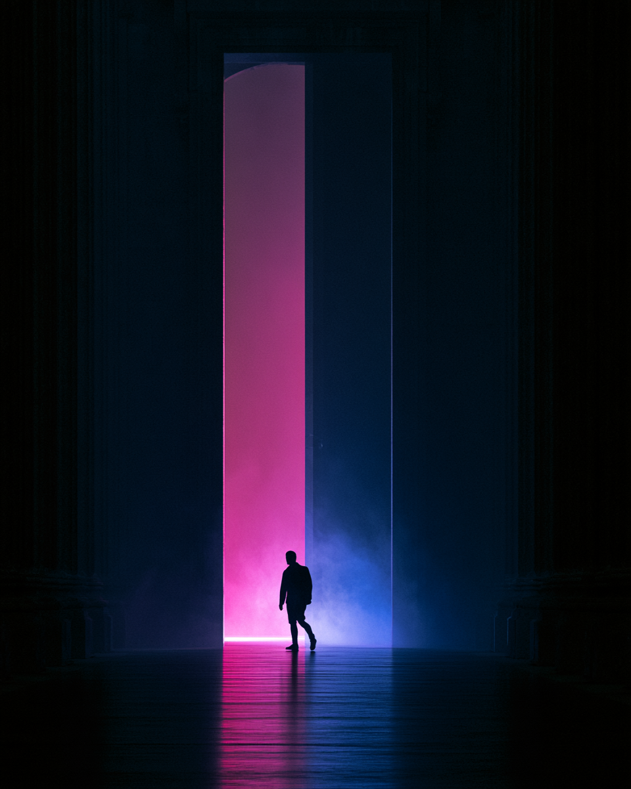

# TÉRA — Estratégia de Marca (R1)

> Relatório gerado a partir exclusivamente do briefing do cliente (`TERA_BRIEFING_CLIENTE.md`, transcrição de "Sala Abaixo_Briefing Reveal Jul2026.pptx"). Onde o briefing não responde, a inferência estratégica está marcada como *(inferência)*. Nenhuma decisão criativa prévia do estúdio foi usada.

---

## 01 — O QUE É A TÉRA?

> *"Algumas obras existem para expandir a percepção."*

A Téra nasce de um gesto duplo: a regeneração de um edifício histórico na Mata São Paulo e a instalação, dentro dele, da maior infraestrutura de LED indoor da América Latina, com resolução de 32K. A crença fundadora está nessa junção: patrimônio não se preserva congelando, se preserva virando plataforma para o futuro. O nome carrega o mesmo peso triplo: *teras*, o extraordinário grego; *tera*, o prefixo da escala monumental; *terra*, o solo como origem e matéria.

Na prática, a Téra é uma sala de vocação multiuso que apresenta e comissiona espetáculos multidimensionais: obras vivas onde música, performance, audiovisual, instalação, dança, gastronomia, moda, ciência e tecnologia deixam de ocupar lugares separados. A experiência é multissensorial e multiperspectiva, a sala muda de configuração a cada projeto, o público participa em vez de assistir, e o espetáculo pode começar antes da apresentação e continuar depois dela. Guiada pela imaginação radical de artistas do Sul Global, a Téra não entrega obras para serem vistas: entrega maneiras novas de perceber e habitar o mundo.

---

## 02 — VISÃO

Tornar-se o território de referência para uma nova categoria cultural, os espetáculos multidimensionais: construída sobre a regeneração de patrimônio, a tecnologia em escala monumental e a imaginação radical do Sul Global.

**Regeneração · Magnitude · Invenção · Encontro**

---

## 03 — MISSÃO

Comissionar e apresentar obras que unem arte, tecnologia, arquitetura, natureza e presença humana num único acontecimento. Transformar espectadores em participantes, o edifício histórico em plataforma viva, e cada temporada em uma expansão do que um espetáculo pode ser.

**Comissionar · Habitar · Participar · Expandir**

---

## 04 — VALORES

**Regeneração.** Cultura como vetor que reocupa e devolve vida a sítios históricos. A Téra não se instala apesar do patrimônio: existe por causa dele.

**Sul Global.** Diversidade, ancestralidade e invenção como um só músculo criativo. Engenharia e engenhosidade brasileiras preparadas para programação de renome mundial.

**Encontro multidimensional.** Linguagens que coexistem sem hierarquia: a obra acontece onde arte, tecnologia, arquitetura, natureza e presença se cruzam.

**Participação ativa.** O público integra a experiência. Não há quarta parede porque não há palco separado da plateia.

**Expansão da percepção.** O critério final de toda obra: ela amplia a maneira como percebemos e habitamos o mundo?

**Regenerar · Inventar · Encontrar · Expandir**

---

## 05 — METAS

**Fundar a categoria:** fazer "espetáculo multidimensional" existir no imaginário público. O briefing é explícito: o desafio não é conhecimento sobre a sala, é entendimento sobre um conceito que ainda não existe.

**Revelar sem mostrar:** executar a Fase 1 (Teaser, Reveal da Sala, Conteúdo manifesto, OOH institucional) preservando o mistério: não mostrar a tela, não revelar o espaço.

**Construir autoridade:** validar institucionalmente o projeto via imprensa, parceiros, tecnologia e vocação artística (Fase 2).

**Gerar desejo:** revelar artistas, formatos e programação para mobilizar a comunidade criativa e o público (Fase 3).

**Converter:** abrir vendas e lotar a inauguração em setembro de 2027 (Fase 4).

**Consolidar a plataforma:** transformar a abertura no início de uma plataforma cultural contínua: cobertura, conteúdo proprietário, repercussão, relacionamento.

---

## 06 — PÚBLICO

Quem busca cultura que ainda não tem nome: gente que já esgotou o formato "exposição imersiva" e quer ser participante de algo maior, não espectador de projeção.

- **Faixa etária:** 25 a 55 *(inferência)*
- **Localização:** São Paulo capital + visitantes nacionais e internacionais *(inferência)*
- **Renda:** média-alta a alta *(inferência)*
- **Intenção de gasto:** premium cultural
- **Foco de cidade:** SP primeiro, projeção internacional

**Marina, 34, diretora de arte, Pinheiros** *(persona inferida)*
Vive de repertório: bienais, festivais, shows, referências.
*"Experiência imersiva virou cenário de story. Eu quero uma obra que me engula de verdade."*
- **Objetivos:** alimentar o próprio trabalho com experiências que ninguém viu ainda.
- **Frustrações:** imersivos rasos, feitos pra foto; tecnologia sem curadoria.
- **Necessidades:** autoria real, escala real, razão pra voltar a cada temporada.
- **Como a Téra resolve:** obras comissionadas e inéditas em infraestrutura que não existe em nenhum outro lugar da América Latina.

**Caio, 41, líder de engenharia, Vila Madalena** *(persona inferida)*
Paga por espetáculo técnico: shows, e-sports, arte digital.
*"Eu quero ver o que 32K numa sala inteira faz comigo."*
- **Objetivos:** experiências de fronteira entre tecnologia e arte.
- **Frustrações:** hype técnico que não entrega; telas grandes com conteúdo pequeno.
- **Necessidades:** a prova de que a infraestrutura serve a uma ideia.
- **Como a Téra resolve:** o maior painel de LED indoor da América Latina a serviço de obras, não de demos.

**Teresa, 58, conselheira cultural e patrona** *(persona inferida)*
Circula entre conselhos, museus e filantropia cultural.
*"Regenerar o Matarazzo com cultura é o tipo de legado que me interessa."*
- **Objetivos:** apoiar projetos com peso institucional e propósito.
- **Frustrações:** empreendimentos culturais sem lastro, patrimônio subutilizado.
- **Necessidades:** validação institucional, narrativa de regeneração verdadeira.
- **Como a Téra resolve:** patrimônio histórico reocupado por uma instituição de vocação artística com parceiros de renome.

---

## 07 — PERSONALIDADE

**Séria (6/8) · Meio-formal (5/8) · Premium (8/8) · Inovadora (8/8) · Ousada (7/8)** *(sliders inferidos do briefing)*

A Téra pensa como uma instituição e sente como uma obra. Fala de coisas enormes com precisão calma: não grita a própria grandiosidade, descreve com exatidão e deixa a escala fazer o resto. Tem o rigor de quem está fundando uma categoria, e por isso nunca usa jargão que não consiga explicar. É misteriosa por estratégia na revelação e generosa por natureza na experiência.

---

## 08 — VOZ

*A Téra fala com assombro preciso: grandiosa nas ideias, exata nas palavras.*

O território verbal é o de uma instituição que precisa ensinar o mundo a nomear algo novo. Isso exige definição sem academicismo, poesia sem vagueza, e a disciplina de repetir a categoria (espetáculos multidimensionais) até ela existir sozinha.

- **Precisa.** Categoria nova se constrói com definição, não com adjetivo. Cada texto responde: o que é, por que importa.
- **Conceitual-acessível.** Traduz física, dimensões e graus de liberdade em linguagem de experiência humana.
- **Institucional-viva.** Autoridade sem burocracia: assina como instituição, respira como obra.
- **Enraizada.** Terra, solo, origem, Sul: o vocabulário volta sempre ao chão antes de ir ao extraordinário.
- **Convidativa.** Escreve para participantes, não para plateias: verbos de habitar, atravessar, integrar.
- **Reticente na revelação.** Na Fase 1, diz menos: sugere a experiência sem mostrar a tela nem o espaço, como o briefing exige.

---

## 09 — ANÁLISE COMPETITIVA

*(O briefing não nomeia concorrentes; leitura inferida da categoria.)*

**Exposições imersivas itinerantes** (Van Gogh & cia.)
- **Visão geral:** projeções 360° de acervos consagrados, formato franquia.
- **Forças:** apelo massivo, fórmula validada, bilheteria previsível.
- **Fraquezas:** commodity criativa; espetáculo raso, feito pra foto; zero comissionamento.
- **Como a Téra difere:** comissiona obras inéditas em vez de licenciar acervos; a sala é instrumento, não cenário.

**teamLab (internacional)**
- **Visão geral:** coletivo japonês, referência mundial em arte digital imersiva com museus próprios.
- **Forças:** autoria forte, qualidade técnica altíssima, marca global.
- **Fraquezas:** um único autor-coletivo; experiência padronizada entre cidades.
- **Como a Téra difere:** plataforma plural de artistas do Sul Global, com a sala mudando de estado a cada temporada.

**Sphere (Las Vegas, internacional)**
- **Visão geral:** o benchmark de escala em LED e espetáculo tecnológico.
- **Forças:** magnitude inigualável, poder de mídia, residências de estrelas globais.
- **Fraquezas:** lógica de entretenimento e aluguel de palco; sem vocação de comissionamento artístico nem regeneração.
- **Como a Téra difere:** escala monumental a serviço de uma instituição cultural, enraizada em patrimônio e no Sul Global.

**Instituições culturais paulistanas** (museus, salas de espetáculo, centros culturais)
- **Visão geral:** o circuito consolidado que disputa o mesmo público cultural.
- **Forças:** legitimidade, acervos, tradição de público.
- **Fraquezas:** infraestrutura tecnológica limitada; formatos consagrados, categoria antiga.
- **Como a Téra difere:** nasce digital-monumental e multiuso; não compete por acervo, funda uma categoria nova.

---

## 10 — POSICIONAMENTO

**Narrativa.** O mercado "imersivo" virou commodity: projeção alugada, acervo licenciado, fila pra foto. No outro extremo, as instituições culturais têm legitimidade, mas raramente têm a infraestrutura ou o apetite para o novo formato. Existe um vazio exato entre os dois: um lugar com peso de instituição e capacidade técnica de espetáculo global, que crie obras em vez de exibi-las. É esse vazio que a Téra ocupa, com um ativo que ninguém pode copiar: o encontro entre um patrimônio histórico regenerado e o maior painel de LED indoor da América Latina.

**Statement.** A Téra é a instituição cultural que transforma patrimônio em plataforma: a sala onde espetáculos multidimensionais, comissionados da imaginação do Sul Global, expandem o que uma obra pode ser.

**Mapa** *(descrito)*: eixo horizontal de **entretenimento licenciado ↔ comissionamento autoral**; eixo vertical de **infraestrutura convencional ↔ tecnologia monumental**. Exposições itinerantes ficam no quadrante licenciado-convencional; Sphere no licenciado-monumental; instituições tradicionais no autoral-convencional. A Téra ocupa sozinha o quadrante **autoral-monumental**.

---

## 11 — COMO A TÉRA SE DESTACA

> *"Não é uma tela para ver. É uma sala para habitar outros mundos."*

A Téra se recusa a ser mais uma "experiência imersiva": não licencia acervos, não aluga projeção, não trata a tecnologia como produto final e, na própria revelação, se recusa a mostrar a tela, porque a tela não é a obra. Essa recusa é estratégica: tudo que é fácil de copiar fica fora da marca.

O que ela assume em troca é mais difícil e mais valioso: comissionar obras inéditas de artistas do Sul Global, sustentar uma sala que muda de estado a cada projeto, e medir cada espetáculo por um único critério: expandir a percepção de quem participa. Num mercado onde todos mostram telas, a Téra mostra mundos.

*Referência gerada (Midjourney) — "não é uma tela para ver, é uma sala para habitar outros mundos": a fonte de luz sempre fora de quadro.*

---

## 12 — SUGESTÕES DE TAGLINE

1. **Espetáculos multidimensionais.** A categoria como assinatura: quando o desafio é fundar um conceito, nomeá-lo sem enfeite é o ato de marca mais forte.
2. **Habite outros mundos.** Verbo do próprio briefing ("habitar o mundo"), convida à participação e diferencia de "ver/assistir".
3. **Onde os mundos acontecem.** Posiciona a sala como lugar-acontecimento, não como tela.
4. **A escala do extraordinário.** Une as duas raízes do nome: tera (magnitude) e teras (prodígio).
5. **Feita para expandir a percepção.** A promessa final do manifesto do cliente, em uma linha.

---

*Próximos módulos naturais sobre esta base: `brand-identity` (brief visual), `brand-voice` (guia verbal completo), `brand-messaging` (hierarquia de mensagens por fase de lançamento), `brand-launch` (plano da Fase 1).*
