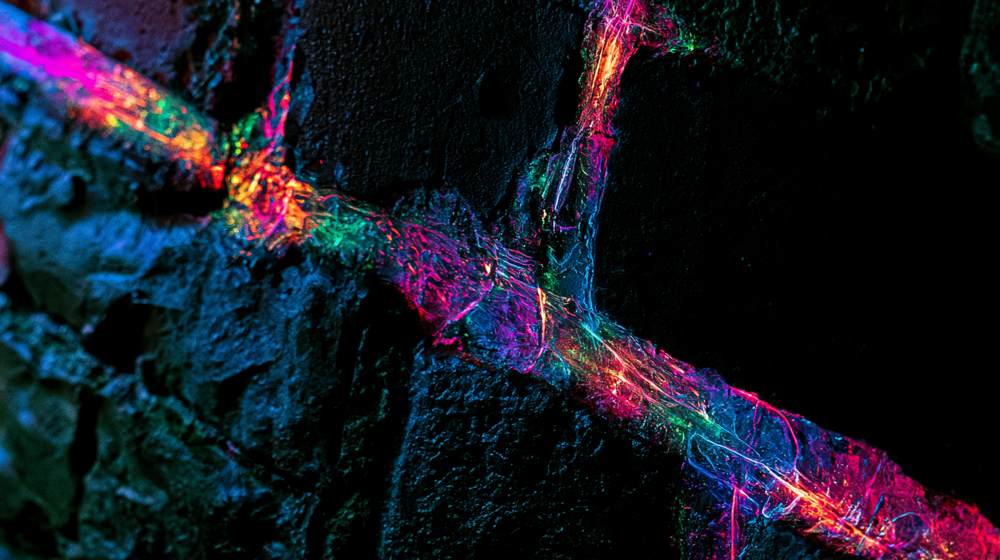
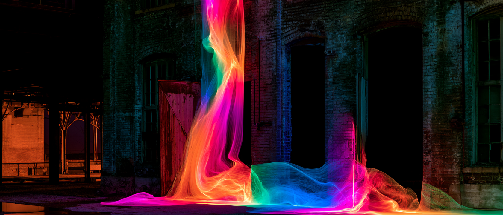
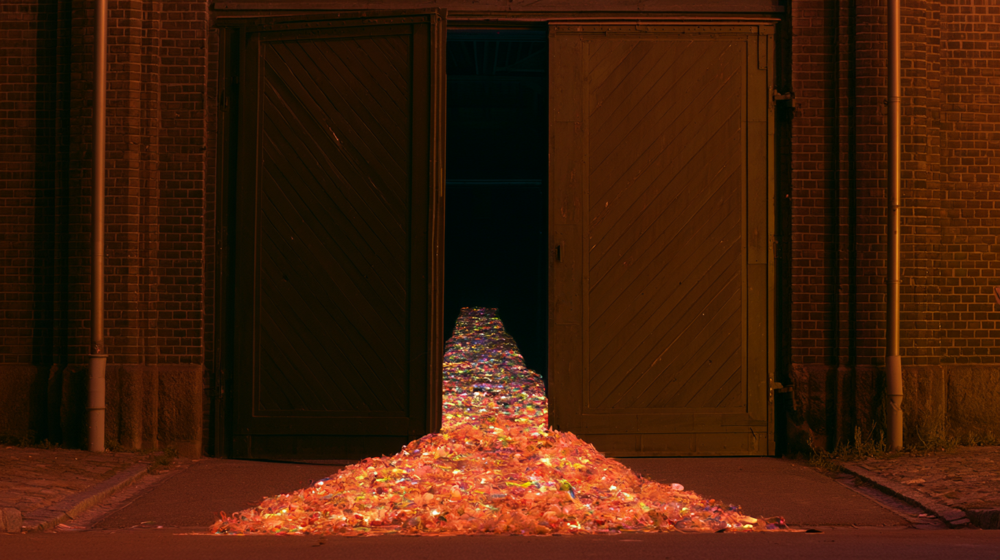

# TÉRA — Manifesto (R1)

> **Fonte:** gerado exclusivamente a partir do briefing do cliente (`TERA_BRIEFING_CLIENTE.md`, transcrição de "Sala Abaixo_Briefing Reveal Jul2026.pptx") e da estratégia `TERA_ESTRATEGIA_R1.md`. Nenhum material criativo prévio do estúdio foi usado. Matéria-prima central: o texto do cliente ("obras vivas", "algumas obras não existem para serem vistas, existem para expandir a maneira como percebemos e habitamos o mundo"), os pilares de regeneração e Sul Global, as 6 características multidimensionais e a etimologia teras/tera/terra.

---

## Direção do texto

- **Tom escolhido:** convicção serena — coerente com a voz R1 ("assombro preciso: grandiosa nas ideias, exata nas palavras"). Sem grito; a escala fala sozinha.
- **Uso primário:** duplo. Interno (alinhar time, parceiros e artistas em torno da categoria) e externo (Fase 1 — "Conteúdo manifesto" do plano de lançamento).
- **O que o manifesto combate:** a imersão-commodity (projeção alugada, acervo licenciado, fila pra foto), o patrimônio congelado como fim em si, e a ideia de que o futuro se importa pronto de outro hemisfério.
- **Restrição da Fase 1 respeitada:** a versão de narração não mostra nem descreve a tela ou o espaço — sugere, não revela.

---

## VERSÃO 1 — Manifesto completo

**Espetáculo vem de *specere*: olhar.**
**Para nós, olhar é pouco.**

Chamaram de imersão o que era cenário. A experiência "imersiva" virou fórmula: projeção alugada, acervo licenciado, fila organizada para a foto. A tecnologia cresceu e a obra encolheu. E o público, que deveria estar dentro, ficou onde sempre esteve — do lado de fora, assistindo.

Enquanto isso, ensinaram que patrimônio se preserva parado: trancado, escorado, protegido do presente. Como se um edifício histórico fosse um fim, e não um fundamento.

E ensinaram que o novo se importa pronto, sempre do mesmo hemisfério.

Acreditamos em outra coisa. Acreditamos em obras vivas — obras que acontecem onde arte, tecnologia, arquitetura, natureza e presença humana deixam de ocupar lugares separados para compor um único acontecimento. Obras sem ponto de vista único, onde cada pessoa constrói a própria experiência. Obras que mudam o estado do espaço, que envolvem o corpo inteiro — visão, som, luz, matéria, temperatura, movimento — e que começam antes da apresentação e continuam depois dela.

Acreditamos que patrimônio se preserva virando plataforma: um edifício histórico devolvido à cidade pela cultura, transformado em solo para o que ainda não existe.

E acreditamos na imaginação radical do Sul Global — territórios onde diversidade, ancestralidade e invenção sempre caminharam juntas. O futuro também nasce daqui. Sempre nasceu.

Porque algumas obras não existem para serem vistas. Existem para expandir a maneira como percebemos e habitamos o mundo.

Isto é para quem já esgotou o formato. Para quem não quer assistir — quer atravessar, integrar, habitar. Para artistas que carregam mundos maiores do que as salas que lhes ofereceram. Para quem entende que participar é a forma mais antiga, e mais nova, de estar diante de uma obra.

Este é o nosso compromisso: comissionar o inédito, não licenciar o pronto. Mudar de estado a cada projeto, sem repetir a sala nem a fórmula. Tratar a tecnologia como meio de criação, nunca como produto final — porque a tela não é a obra. E medir cada espetáculo por um único critério: ele expande a maneira como percebemos e habitamos o mundo?

Do prodígio, *teras*. Da escala, *tera*. Do solo, *terra*.

**Téra. Espetáculos multidimensionais.**

---

## VERSÃO 2 — Manifesto curto

Espetáculo vem de *specere*: olhar. Para nós, olhar é pouco.

Chamaram de imersão o que era cenário: projeção alugada, acervo licenciado, fila pra foto — o público sempre do lado de fora.

Acreditamos em obras vivas: onde arte, tecnologia, arquitetura, natureza e presença humana compõem um único acontecimento; onde a sala muda de estado, o tempo se expande e cada pessoa constrói a própria experiência. Acreditamos que patrimônio se preserva virando plataforma para o futuro. E que o futuro também nasce no Sul — onde diversidade, ancestralidade e invenção sempre caminharam juntas.

Algumas obras não existem para serem vistas. Existem para expandir a maneira como percebemos e habitamos o mundo.

Do prodígio, *teras*. Da escala, *tera*. Do solo, *terra*.

**Téra. Espetáculos multidimensionais.**

---

## VERSÃO 3 — Narração para vídeo (45–60s)

> Para o "Conteúdo manifesto" da Fase 1 (Revelar). Respeita a direção do cliente: não mostra a tela, não revela o espaço — o texto acompanha a imagem do plasma brotando das frestas do complexo. ~130 palavras ≈ 50–55 segundos em ritmo de narração calmo. Marcações `//` = pausa.

Espetáculo vem de uma palavra antiga: olhar. //
Para nós, olhar é pouco. //

Chamaram de imersão o que era cenário. //
Nós acreditamos em obras vivas. //
Obras onde arte, tecnologia, arquitetura, natureza e presença humana compõem um único acontecimento. //
Onde não existe um único ponto de vista — cada pessoa constrói a própria experiência. //
Onde o espaço muda de estado. O tempo se expande. //
E o público não assiste: participa. //

Na Mata São Paulo, um edifício histórico volta à vida para dar origem a essa nova forma de encontro. //
Criada no Sul — onde diversidade, ancestralidade e invenção sempre caminharam juntas. //

Porque algumas obras não existem para serem vistas. //
Existem para expandir a maneira como percebemos e habitamos o mundo. //

Téra. // Espetáculos multidimensionais.

### Notas de produção

- **Sincronia sugerida:** o bloco "Chamaram de imersão..." acompanha o plasma brotando das primeiras frestas; "Na Mata São Paulo..." acompanha o rio de plasma descendo pelo complexo; a assinatura final coincide com a matéria digital entrando pelo vão das portas — sem nunca mostrar o interior.

### Storyboard de referência (imagens geradas — Midjourney)

*Beat 1 — "Chamaram de imersão o que era cenário": a luz vazando das primeiras frestas.*

*Beat 2 — "Na Mata São Paulo...": o rio de plasma percorrendo a arquitetura.*

*Beat 3 — assinatura final: a porta é o limite do quadro; o interior nunca aparece.*
- **Corte de 45s:** se necessário, remover as linhas "Onde o espaço muda de estado..." e "E o público não assiste: participa." (a definição de obras vivas já sustenta o conceito).
- **Regra intocável:** as duas frases do cliente — "obras vivas" e "algumas obras não existem para serem vistas..." — permanecem literais em qualquer corte.
